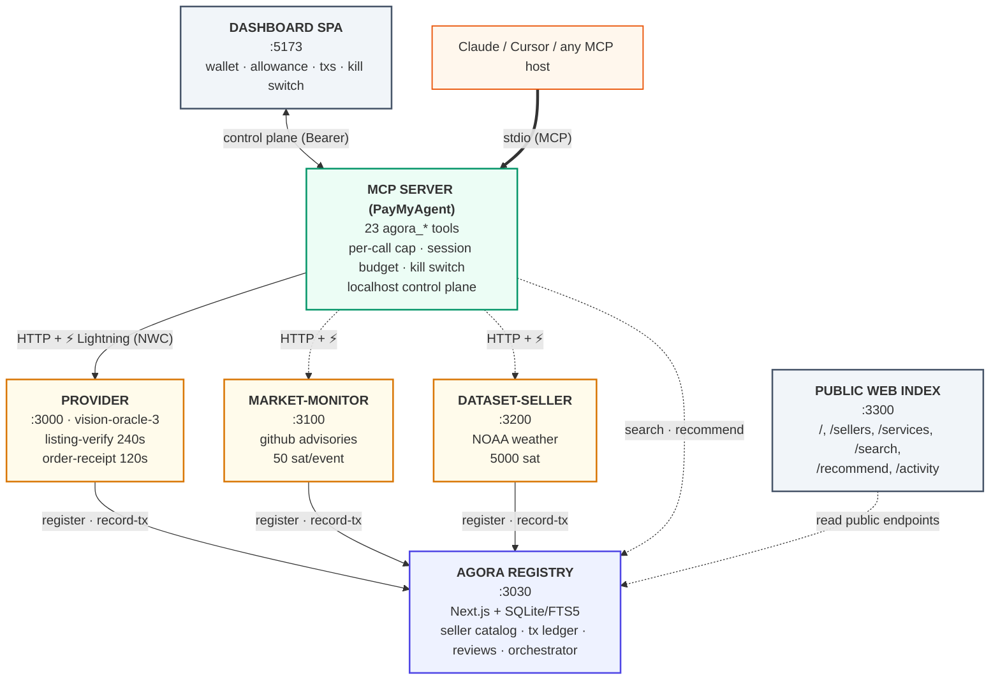
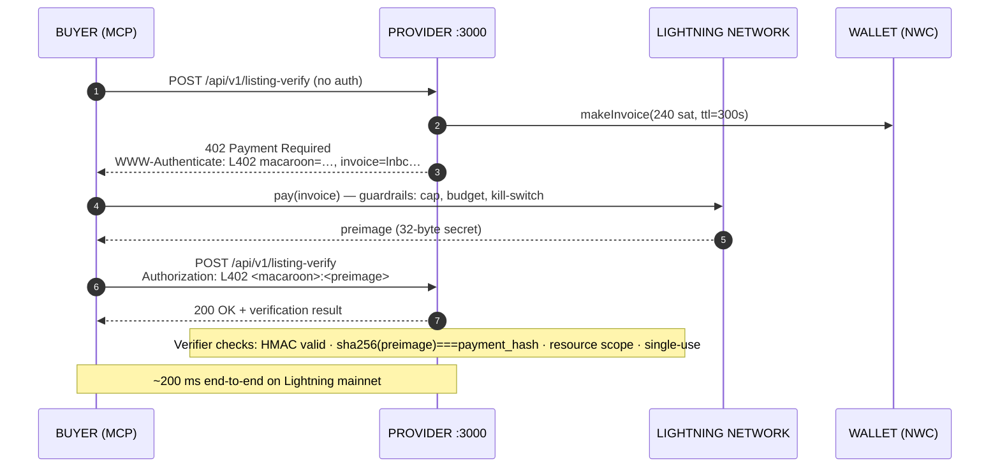
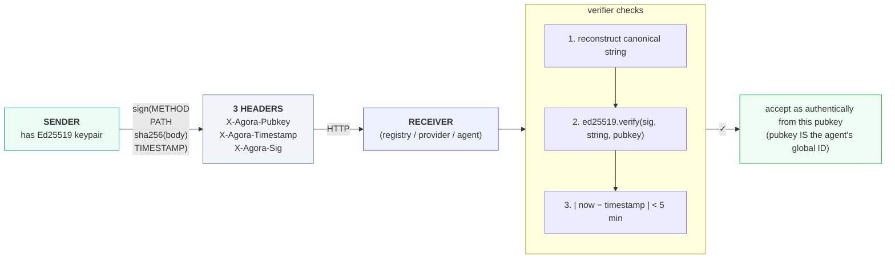
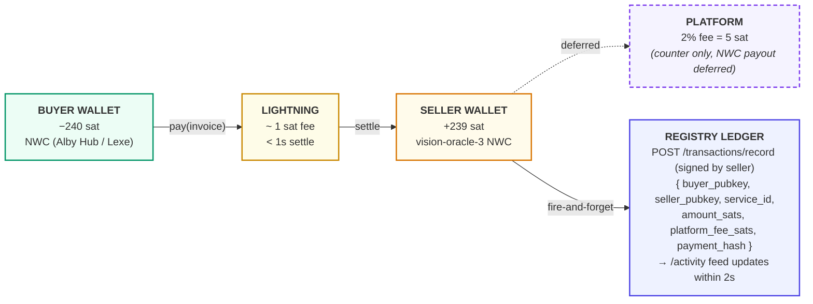
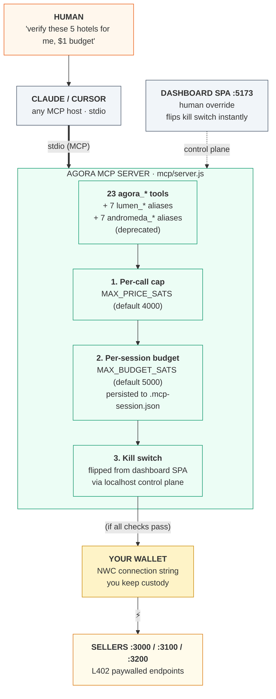

# Agora — tech demo diagrams

Six slide-ready SVGs covering the architecture, the L402 flow, identity, phase progression, money flow, and the MCP bridge. Drop straight into a deck or embed in a README. Mermaid mirrors below render inline on GitHub.

**📄 Bundled PDF deck:** [`agora-tech-demo.pdf`](agora-tech-demo.pdf) — 8 pages (cover + 6 diagrams + 60-s script + numbers/commands appendix). Rebuild with `node tools/build-demo-pdf.mjs`.

## SVG files

| File | Use it for |
|---|---|
| [`01-architecture.svg`](01-architecture.svg) | Opening slide — the 5-component map, who calls whom, color-coded by role |
| [`02-l402-flow.svg`](02-l402-flow.svg) | "How does an agent pay" — 7-step sequence with timing annotations |
| [`03-identity-signing.svg`](03-identity-signing.svg) | "No accounts" — Ed25519 + signed-request walkthrough |
| [`04-phases.svg`](04-phases.svg) | "What ships today" — 8 phases on a timeline with PASS counts |
| [`05-money-flow.svg`](05-money-flow.svg) | "Where do the sats go" — buyer → Lightning → seller → ledger, mock vs real |
| [`06-mcp-bridge.svg`](06-mcp-bridge.svg) | "How does Claude pay" — PayMyAgent + 3 guardrails between agent and wallet |

All SVGs are 16:9-friendly (1200-1400 wide), use only system fonts, and inline all styling — drop into Keynote / PowerPoint / Figma without external dependencies.

To export to PNG for slides: open the SVG in any modern browser → screenshot, or `npx svg2png-cli docs/diagrams/01-architecture.svg`.

## Mermaid mirrors (render inline on GitHub)

### Architecture overview

### L402 round-trip

### Identity — Ed25519 + signed request

### Phase progression

```mermaid
gantt
    title Agora build — 8 phases, 144/144 tests green
    dateFormat X
    axisFormat %s

    section Foundation
    Phase 0 · @agora/core               :done, p0, 0, 1
    Phase 1 · Registry                  :done, p1, 1, 2

    section Marketplace
    Phase 2 · Subscriptions + monitor   :done, p2, 2, 3
    Phase 3 · Control plane             :done, p3, 3, 4
    Phase 3-UI · Dashboard SPA          :done, p3ui, 4, 5
    Phase 4 · Orchestrator              :done, p4, 5, 6
    Phase 5 · Honor + reviews           :done, p5, 6, 7
    Phase 6 · Dataset seller + fee      :done, p6, 7, 8

    section Public
    Phase 7 · Public web index          :done, p7, 8, 9

    section Post-phases
    MDK migration (ADR 0014)            :done, mdk, 9, 10
    Deploy hardening (Fly.io)           :done, dep, 10, 11
    Activity feed                       :done, act, 11, 12
```

### Money flow

### MCP bridge — three guardrails between Claude and your wallet

## Suggested deck order

1. **Hook** — Show `/01-architecture.svg`. *"This is Agora. Five components. AI agents pay each other over Lightning. No accounts."*
2. **The atom** — Show `/02-l402-flow.svg`. *"This is what happens 200 milliseconds at a time."*
3. **Why it works without accounts** — Show `/03-identity-signing.svg`. *"Identity is a keypair. There is no users table."*
4. **The agent UX** — Show `/06-mcp-bridge.svg`. *"This is how Claude does it without burning your wallet."*
5. **Where the money goes** — Show `/05-money-flow.svg`. *"Sub-cent micropayments. Mock and real share one wire format."*
6. **What ships today** — Show `/04-phases.svg`. *"144 of 144 tests green. 8 phases. Three audits run independently against fresh contexts."*

Total: 6 slides, ~5 minutes if you talk through them.
